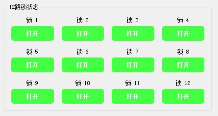

# RS485 Lock Board Communication Tester

[](https://github.com)
[](LICENSE)
[](https://www.qt.io/)

English | [简体中文](README.md)

## Project Overview

RS485 lock board communication testing tool based on Qt 5.15.2, supporting 12-channel lock control and complete protocol command verification.

### Screenshots

<div align="center">
  
  
</div>
<div align="center">
  
</div>

> 💡 Note: Screenshots are placeholders, please refer to the running application for actual interface

## Platform Support

| Platform | Status | Notes |
|----------|--------|-------|
| ✅ Windows | Fully Supported | Windows 10/11, pre-compiled executable |
| ✅ Linux | Fully Supported | Ubuntu/Debian/Fedora/Arch, build from source |
| ⚠️ macOS | Theoretical Support | Untested, requires manual build |

### Linux Quick Start

```bash
# 1. Clone or download the project
cd lockBoard

# 2. Run automated setup script (recommended)
sudo bash scripts/setup-linux.sh

# 3. Build the project
qmake LockBoardTester.pro
make -j$(nproc)

# 4. Run the application
./LockBoardTester
```

**Detailed installation guide**: See [Linux Setup Guide](docs/linux-setup.md)

## File Structure

- **Executable**: `release/LockBoardTester.exe`
- **Source Code Directory** (`src/`):
  - `main.cpp` - Program entry point
  - `mainwindow.h/cpp` - Main window interface
  - `protocol/protocol485.h/cpp` - 485 protocol encapsulation (9 commands support)
  - `serial/serialmanager.h/cpp` - Serial port management (9600 baud, 8N1 config)
  - `ui/mainwindow.ui` - Qt interface design file
  - `ui/lockstatuswidget.h/cpp` - 12-channel lock status visualization component
  - `ui/debugconsole.h/cpp` - Debug console (hexadecimal logging)
- **Project Configuration**: `LockBoardTester.pro`
- **Protocol Documentation**: `protocol.txt` / `485锁控板通讯协议 -12(1)(1).pdf`

## Features

### Supported Protocol Commands

| Command | Function | Description |
|---------|----------|-------------|
| 0x01 | Get Version | Query MCU firmware version |
| 0x10 | Open Single Lock | Open lock on specified channel |
| 0x11 | Read Single Lock Status | Read on/off status of specified lock |
| 0x12 | Read All Lock Status | Read all 12 lock statuses at once |
| 0x14 | Open All Locks | Open all 12 locks simultaneously |
| 0x15 | Open Multiple Locks | Select multiple locks by bit mask |
| 0x16 | Continuous Output Control | For relays/lighting continuous power devices |
| 0x18 | Open Multiple Locks Simultaneously | Dedicated for multi-lock single door scenarios |
| 0x1A | Multi-Channel Output Control | Batch control multiple channel output states |

### Interface Layout

**Left - Connection Configuration**
- Serial port selection dropdown (auto-scan available ports)
- Refresh ports button
- Connect/Disconnect button
- Board address selection (1-15)

**Center - Function Test Area (5 Tabs)**
1. **Basic Functions**: Get version, open all locks, read all statuses
2. **Single Channel Control**: Select channel, open lock, read status
3. **Multi-Channel Control**: 12 checkboxes for batch selection
4. **Continuous Output**: Channel selection, on/off control
5. **Multi-Channel Output**: Batch output control

**Right Top - Lock Status Display**
- 12 visual indicators (3×4 grid layout)
- Color coding:
  - 🟢 Green = Lock Open
  - 🔴 Red = Lock Closed
  - ⚪ Gray = Unknown/No Response
- Real-time status updates

**Right Bottom - Debug Console**
- Sent data (blue marker)
- Received data (green marker)
- Error messages (red marker)
- Hexadecimal format display
- Timestamp logging
- Clear/save log functions

## Usage

### 1. Hardware Connection

```
PC (USB) <---> USB-to-RS485 Converter <---> Lock Board
```

- Baud Rate: 9600
- Data Bits: 8
- Stop Bits: 1
- Parity: None

### 2. Launch Program

Run `release/LockBoardTester.exe`

### 3. Establish Connection

1. Click "Refresh Ports" to scan available serial ports
2. Select the corresponding COM port
3. Set board address (matching hardware DIP switch settings)
4. Click "Connect" button

### 4. Test Functions

#### Verify Communication
- Click "Get Version" button
- Check debug console for response
- Confirm communication is working

#### Lock Test
- Switch to "Single Channel Control" tab
- Select lock channel (1-12)
- Click "Open Lock"
- Observe status indicator changes

#### Batch Operations
- Switch to "Multi-Channel Control" tab
- Check locks to operate
- Click "Open Multiple Locks"
- Review debug logs and status updates

## Protocol Format

### Send Frame Format
```
[0xDC] [0x02] [Address] [Command] [Length] [Data] [Checksum]
```

### Receive Frame Format
```
[0xDC] [0xFE] [Address] [Command] [Length] [Data] [Checksum]
```

### Checksum Calculation
```
Checksum = (Address + Command + Length + Data bytes) % 256
```

### Example: Open Lock #1
```
Send: DC 02 01 10 01 01 13
      │   │  │  │  │  │  └─ Checksum (01+10+01+01=13)
      │   │  │  │  │  └──── Lock ID=1
      │   │  │  │  └─────── Data Length=1
      │   │  │  └────────── Command=0x10
      │   │  └───────────── Address=1
      │   └──────────────── Header 0x02
      └──────────────────── Header 0xDC

Reply: DC FE 01 10 02 01 01 15
       │   │  │  │  │  │  │  └─ Checksum
       │   │  │  │  │  │  └──── Status=1 (Success)
       │   │  │  │  │  └─────── Lock ID=1
       │   │  │  │  └────────── Data Length=2
       │   │  │  └───────────── Command=0x10
       │   │  └──────────────── Address=1
       │   └─────────────────── Header 0xFE
       └─────────────────────── Header 0xDC
```

## FAQ

### Q: Cannot find serial port?
A: 
- Check if USB-to-RS485 device driver is properly installed
- Confirm COM port number in Device Manager
- Click "Refresh Ports" button

### Q: No response to commands?
A:
- Verify board address matches hardware DIP switch settings
- Check RS485 wiring (A to A, B to B)
- Review debug console for error messages
- Try disconnect and reconnect

### Q: Status indicators not updating?
A:
- Manually click "Read All Status" to refresh
- Check communication logs to confirm response received
- Verify data frame format is correct

### Q: How to test multiple board cascade?
A:
- Set different hardware addresses for boards (1-15)
- Switch addresses in software to communicate
- Can only communicate with one address at a time

## Development Info

- **Development Environment**: Qt 5.15.2 + MinGW 8.1.0 64-bit
- **Build System**: qmake + mingw32-make
- **Dependencies**: QtWidgets, QtGui, QtSerialPort, QtCore

## Rebuild

To rebuild after modifying source code:

```powershell
# Setup Qt environment
$env:PATH = "D:\QT\5.15.2\mingw81_64\bin;D:\QT\Tools\mingw810_64\bin;$env:PATH"

# Generate Makefile
qmake LockBoardTester.pro

# Build
mingw32-make

# Executable generated at release/LockBoardTester.exe
```

## Technical Support

If you encounter issues, check:
1. Protocol documentation: `protocol.txt`
2. Raw data frames in debug console
3. Checksum calculation correctness

## Version History

- **v1.0.0** (2026-06-30)
  - Initial release
  - Support for all 9 protocol commands
  - 12-channel lock status visualization
  - Debug console logging functionality

## License

This project is licensed under the MIT License - see the [LICENSE](LICENSE) file for details